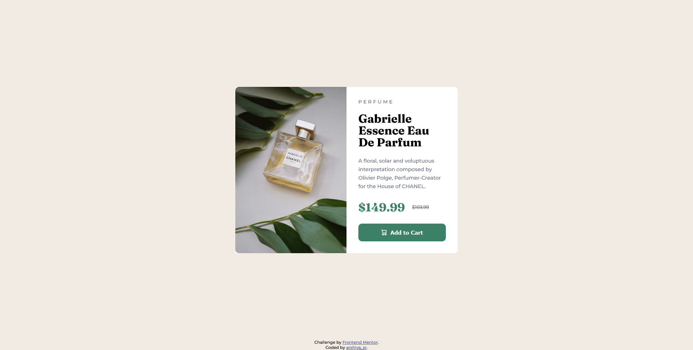
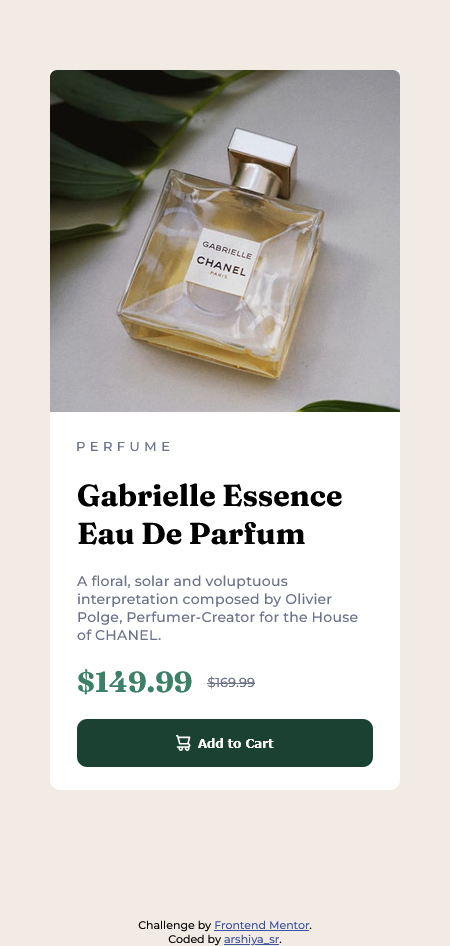

# Frontend Mentor - Product preview card component solution

This is a solution to the [Product preview card component challenge on Frontend Mentor](https://www.frontendmentor.io/challenges/product-preview-card-component-GO7UmttRfa). Frontend Mentor challenges help you improve your coding skills by building realistic projects. 

## Table of contents

- [Overview](#overview)
  - [The challenge](#the-challenge)
  - [Screenshot](#screenshot)
  - [Links](#links)
- [My process](#my-process)
  - [Built with](#built-with)
  - [What I learned](#what-i-learned)
  - [Continued development](#continued-development)
  - [Useful resources](#useful-resources)
  - [AI Collaboration](#ai-collaboration)
- [Author](#author)
- [Acknowledgments](#acknowledgments)

**Note: Delete this note and update the table of contents based on what sections you keep.**

## Overview

### The challenge

Users should be able to:

- View the optimal layout depending on their device's screen size
- See hover and focus states for interactive elements

### Screenshot

### Links

- Solution URL: [solution URL](https://github.com/arshiya-sr/frontend-mentor-Product-preview-card-Project)
- Live Site URL: [live site URL](https://arshiya-sr.github.io/frontend-mentor-Product-preview-card-Project/)

## My process

### Built with

- Semantic HTML5 markup
- CSS custom properties
- Flexbox
- Mobile-first workflow
- AI collabration

### What I learned

The most important thing I learned from this project was making my designs responsive and creating two distinct layouts — one for desktop and one for mobile. Designing for mobile first was also really interesting.

### Continued development

- i'll probably style this project more in future.
- i look forward to make this project and other projects more responsive with relative units.
- i might expand this project into larger one or use this in future projects.

### Useful resources

- (https://www.deepseek.com) - deepseek has helped me alot in my journey and its better to use it for actually learning things instead of cheating and passing projects.
- (https://github.com/copilot) - this AI also helped me alot, even more than deepseek, its perfect for coding, always make you think you are stupid with how good it write professional codes.
- (https://www.freecodecamp.org) - i learned my little knowledge about web developing in FreeCodeCamp, it is free and you can spend your time learning from there too, it has theory, lab, workshop and even quiz and review projects to help you learn the most of everything.

### AI Collaboration

- What tools did you use (e.g., ChatGPT, Claude, GitHub Copilot)? i only used deepseek (mostly for translation from persian to english) and github copilot AI
- How did you use them (e.g., debugging, generating boilerplate, brainstorming solutions)? I used it solely for debugging small parts and understanding the overall structure

## Author

- github - (https://github.com/arshiya-sr)
- Frontend Mentor - (https://www.frontendmentor.io/profile/arshiya-sr)
- FreeCodeCamp - (https://www.freecodecamp.org/arshiya_sr)

## Acknowledgments

thanks to frontend mentor for this awesome Project/Challenge, and thank to you for spending your time and paying your attention to my project. i'd be happy to receive your advice and recommendations.
hope you a good day ♥
